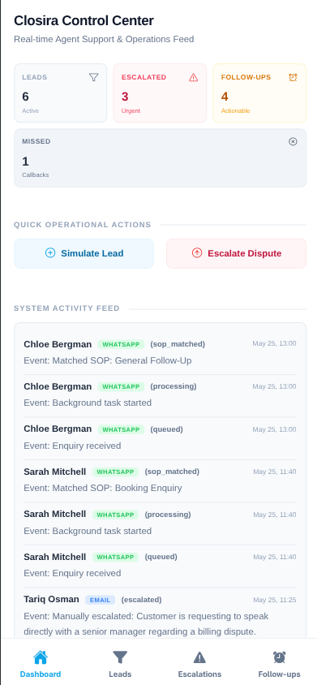
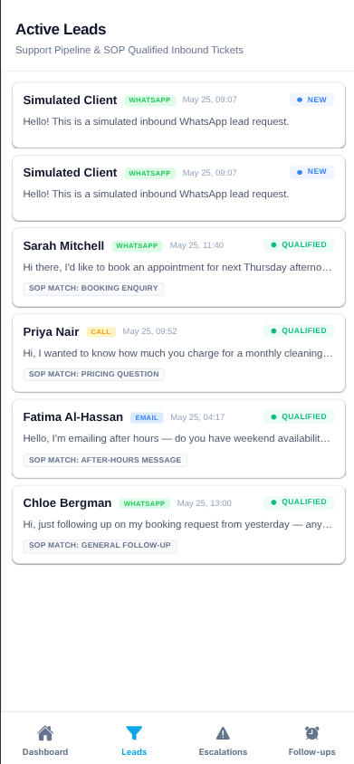
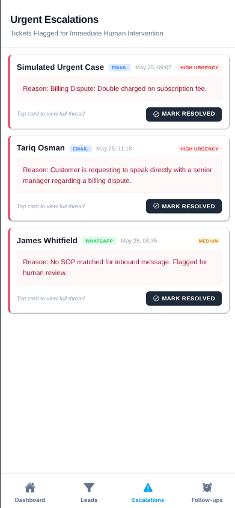
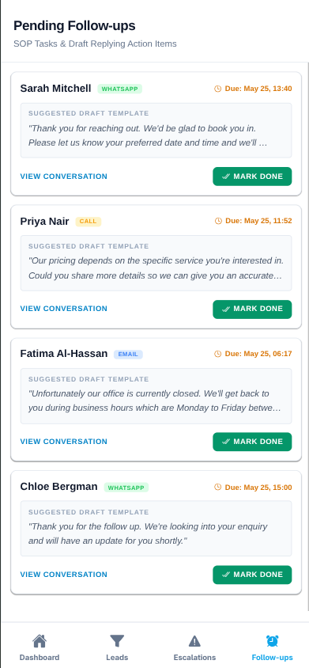
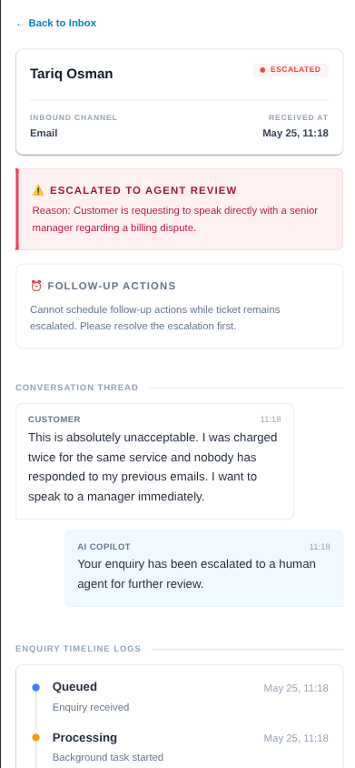
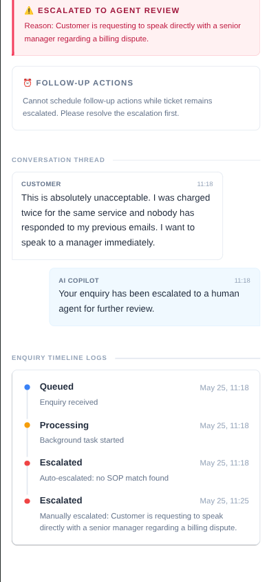

# Closira Mobile Client

Closira is a real-time, AI-assisted customer communication console designed for small business owners. It lets owners manage inbound customer enquiries, check automated follow-ups, and handle urgent escalations all from their phone.

This mobile frontend is built with **Expo (React Native)** and **NativeWind** (Tailwind CSS for React Native).

## Getting Started

To get the app running locally on your phone or simulator, follow these quick steps:

```bash
# Clone the repository
git clone https://github.com/le-Affan/closira-fullstack

# Navigate to the frontend directory
cd closira-fullstack/frontend

# Install dependencies
npm install

# Start the Expo development server
npx expo start
```

Once the Metro bundler starts up, open the **Expo Go** app on your iOS or Android device and scan the QR code displayed in your terminal.

---

## App Screens

The navigation is structured around a bottom tab bar (Home, Leads, Escalations, Follow-ups) with the Conversation Detail pushed as a stack screen on top of the tabs.

* **Home (Dashboard)** — Displays our central control stats (Leads, Escalated, Follow-ups, Missed), quick action buttons to simulate inbound inquiries, and a live activity feed showing recent system events.
* **Leads** — A clean list of active inbound enquiries containing channel badges (WhatsApp, Email, Call), qualification indicators, and tappable cards that navigate to the chat history.
* **Escalations** — A dedicated screen showing active escalation tickets requiring direct owner intervention. Contains priority urgency labels and a quick, silent resolve button.
* **Follow-ups** — Lists scheduled follow-up tasks and suggested draft replies. Pressing "Mark Done" dims the card in-place to avoid jarring UI shifts.
* **Conversation Detail** — Shows the full message thread history, chronological system timeline events, custom status tags, and AI-generated request summaries.

---

## Technical Details

### Styling: Why NativeWind?
Instead of cluttering components with verbose React Native `StyleSheet` objects, we went with NativeWind (Tailwind CSS). Inline utility classes are faster to write, make design consistency across components automatic, and keep screen files highly readable during code reviews. It also makes adjusting responsive layouts and paddings for small vs large devices trivial.

### Mock Data & API Parity
To speed up frontend development without waiting on the backend, all app data is loaded from simulated JSON payloads in `mocks/enquiries.js`. The schemas mirror actual database models, with proper field names and standard ISO timestamps. If we want to connect to a live backend, we only need to update the fetching logic inside `services/api.js`—all UI callers remain completely untouched.

### Reusable Component Structure
Every core UI element is isolated into its own reusable component in the `components/` directory (e.g., `EnquiryCard.js`, `StatusBadge.js`, `MessageBubble.js`, `TimelineEvent.js`, `EmptyState.js`). This keeps our main tab files focused on layout and data hooks rather than bloated markup.

---

## Known Limitations

* All data is simulated locally via the mock layer; there is no active live backend sync.
* No active push notification service configured for escalations.
* The follow-up completion handler is UI-only and does not dispatch real email or SMS replies.
* Optimized and tested specifically on Expo Go environments.

---

## Screenshots

### Home (Dashboard) & Leads
<p align="center">
  
  &nbsp; &nbsp;
  
</p>

### Escalations & Follow-ups
<p align="center">
  
  &nbsp; &nbsp;
  
</p>

### Conversation Detail Threads
<p align="center">
  
  &nbsp; &nbsp;
  
</p>
